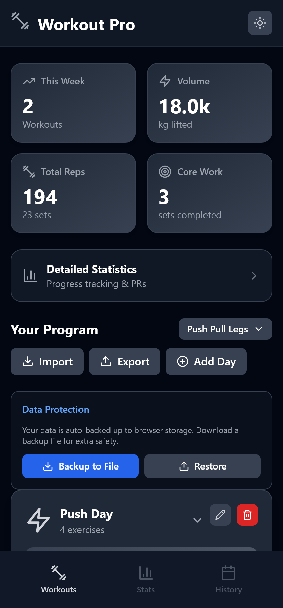
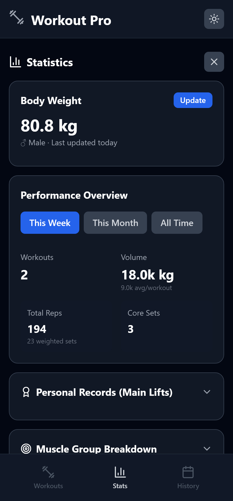
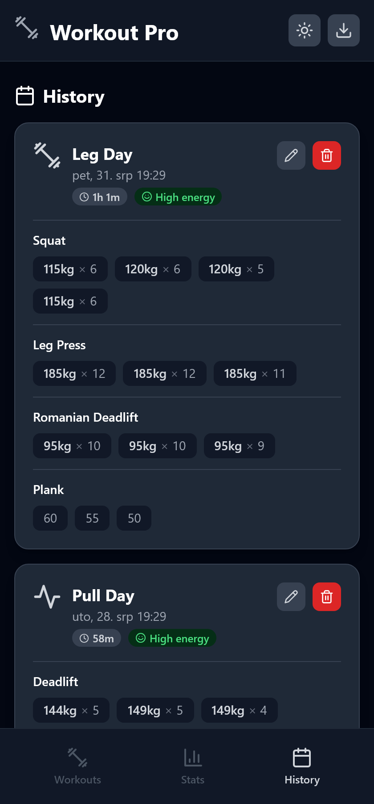

# 💪 Workout Pro

A React-based Progressive Web App (PWA) for tracking workouts — offline-first, with programs, statistics, strength standards, and coaching-style recommendations. All data stays on your device.


## 📸 Screenshots

| Home | Statistics | History |
|:---:|:---:|:---:|
|  |  |  |

## ✨ Features

- 🗂️ **Multiple Programs** - Keep several training programs side by side, switch the active one, rename/delete, import a markdown file as a new program, and export a program back out. Workout history is tagged with the program it was logged under, so stats can be filtered per program or viewed across all
- 📊 **Detailed Statistics** - Volume, reps, sets, personal records, weekly (Mon–Sun calendar week) and monthly comparisons, all-time totals
- 💪 **Strength Standards** - Gender-specific Symmetric Strength bands (Untrained → Elite) from estimated 1RM relative to bodyweight. Only competition-style barbell variants count toward main lifts (Squat, Bench Press, Deadlift, Overhead Press) — Leg Press, RDL, dumbbell variants are deliberately excluded to keep the bands meaningful
- 🧠 **Proactive Recommendations** - Progress detection, plateau detection, deload cues, exercise-swap suggestions, "+1 rep last time, push for one more" prompts, and bodyweight-aware progress (same lift at lower bodyweight is a strength gain)
- 🔋 **Energy Level Logging** - Rate a session low / medium / high; energy shows on the volume timeline and feeds an energy-vs-volume stats section (which only renders once there's enough data to say anything honest)
- ⏱️ **Live Workout Timer** - Elapsed session time in the logging header
- 📏 **Per-Exercise Units** - Reps, seconds, or meters per exercise (auto-detected by name, overridable per template). Time and distance work is counted separately from weighted volume
- 📝 **Exercise Notes** - Free-text notes from the markdown import or default program, shown read-only while logging
- ⚖️ **Body Weight Tracking** - Per-session bodyweight snapshot, used for bodyweight-relative strength metrics
- 📈 **Progress Timeline** - Daily volume and rep charts with hover tooltips and clickable points (2 weeks → all time)
- 📱 **Progressive Web App** - Install on Android/iOS, works fully offline via IndexedDB
- 🌓 **Dark/Light Mode**
- 📥 **CSV Export & JSON Backup** - Export history to CSV; full backup/restore via JSON (programs, history, bodyweight, gender)
- 🔒 **Privacy First** - No backend, no accounts, no analytics

## 🚀 Quick Start

### Use the live app

1. Open the deployed Netlify URL on your phone
2. Android: menu (⋮) → "Install app" / "Add to Home screen"
3. iOS: share icon → "Add to Home Screen"

### Run locally

```bash
git clone https://github.com/niksaderek/workout-app.git
cd workout-app
npm install

# Build styles.css (purged Tailwind) and app.js (Babel-compiled JSX)
npm run build

# Serve the root directory
python -m http.server 8000
# → http://localhost:8000
```

## 🏋️ Usage

### Home
- Weekly stats (workouts, volume, reps, core sets)
- Active program selector — switch, create, rename, delete programs
- Workout day cards: start, edit, delete, reorder exercises, add custom days
- Import a markdown routine as a new program

### During a workout
- Sets pre-filled per set from the last session (ramps preserved); reps pre-filled from the planned target
- Live elapsed timer in the header
- Weight and reps/seconds/meters per set, marked completed as you go
- Smart weight suggestion with the reason (progress / plateau / deload / rep-up)
- Mid-workout exercise substitution from same-muscle-group alternatives
- Optional difficulty rating and end-of-session energy level
- Decimal weights accept comma or dot (`22,5` or `22.5`)

### Statistics
- Scope chip: all history or a single program
- Weekly and monthly progress with period-over-period comparison
- Personal records and estimated 1RM (Epley), tap a lift for its progression
- Strength standards with 5-segment progress bars
- Exercise progress charts per exercise
- Progress timeline (volume + reps per day)

### History
- All completed workouts, editable (including fixing a mis-named exercise)
- Delete individual entries
- CSV export (`Date,Workout,Exercise,Set,Weight,Reps`, Croatian date locale)

## 🛠️ Tech Stack

- **React 18** — via CDN, no bundler
- **Babel CLI** — precompiles `app.jsx` → `app.js` at build time
- **Tailwind CSS** — precompiled, purged subset in `styles.css`
- **IndexedDB** — local storage (`WorkoutTrackerDB` v3)
- **Inline SVG icons** — no icon library, no CDN dependency
- **Service Worker + Web App Manifest** — offline support and installability

## 📂 Project Structure

```
workout-app/
├── app.jsx                 # All React source — edit this
├── app.js                  # Build artifact (Babel output), committed
├── index.html              # Static shell that loads /app.js
├── input.css               # Tailwind entry
├── styles.css              # Build artifact (purged Tailwind), committed
├── tailwind.config.js      # Content glob — must cover every file with Tailwind classes
├── manifest.json           # PWA manifest
├── sw.js                   # Service worker (bump CACHE_NAME on deploy)
├── netlify.toml            # Netlify build config
├── PROJECT_REFERENCE.md    # Full technical reference
└── README.md               # This file
```

**Edit `app.jsx`, never `app.js`.** After changes run `npm run build:js` (or `npm run build` for CSS too).

## 📊 Data Storage

IndexedDB, database `WorkoutTrackerDB` (v3):

- `programs` — training programs, each holding its workout days (`{id, name, workouts: [...]}`)
- `history` — completed workout logs (auto-increment)
- `bodyWeight` — bodyweight entries (auto-increment)
- `workouts` — dormant legacy store, kept only for one-time migration

Backup JSON is at version 1.3 (carries `programs` + `activeProgramId`). Older flat-`workouts` backups still restore.

**Privacy**: data never leaves your device. No backend, no tracking, no analytics.

## 🔄 Deployment

Netlify builds from `netlify.toml`: `npm install && npm run build`, publishing the root directory with an SPA redirect to `/index.html`. Every push to `master` deploys.

After deploying, bump `CACHE_NAME` in `sw.js` so installed PWAs pick up the new build. HTML is served stale-while-revalidate — a new version appears on the second launch, or immediately via the "Update Now" toast.

Works on any static host (Vercel, GitHub Pages, Cloudflare Pages, Firebase) as long as the build step runs.

## 📥 Importing Workouts

Import a markdown routine as a new program. Supported formats are auto-detected:

- `## Exercise` with `Sets: 3` / `Reps: 8`
- Bulleted lists (`- Sets: 3`)
- Tables (`| Exercise | Sets | Reps |`)
- Compact notation (`3x8`)

```markdown
# Leg Day 🦵
## Squat
Sets: 4
Reps: 8

## Leg Press
3x10

# Upper Body 💪
| Exercise | Sets | Reps |
|----------|------|------|
| Bench Press | 3 | 8 |
| Rows | 3 | 10 |
```

Emoji in a day header selects its icon; missing fields default to 3 sets × 10 reps.

## 🤝 Contributing

Pull requests welcome.

1. Fork the repository
2. Create your feature branch (`git checkout -b feature/AmazingFeature`)
3. Commit your changes
4. Push and open a Pull Request

Read `PROJECT_REFERENCE.md` first — several behaviors that look like bugs are deliberate (the main-lift whitelist, the ordered muscle-group rules, stats sections that render nothing on small samples).

## 📝 License

MIT License

```
Copyright (c) 2025 Nikša Derek

Permission is hereby granted, free of charge, to any person obtaining a copy
of this software and associated documentation files (the "Software"), to deal
in the Software without restriction, including without limitation the rights
to use, copy, modify, merge, publish, distribute, sublicense, and/or sell
copies of the Software, and to permit persons to whom the Software is
furnished to do so, subject to the following conditions:

The above copyright notice and this permission notice shall be included in all
copies or substantial portions of the Software.

THE SOFTWARE IS PROVIDED "AS IS", WITHOUT WARRANTY OF ANY KIND, EXPRESS OR
IMPLIED, INCLUDING BUT NOT LIMITED TO THE WARRANTIES OF MERCHANTABILITY,
FITNESS FOR A PARTICULAR PURPOSE AND NONINFRINGEMENT. IN NO EVENT SHALL THE
AUTHORS OR COPYRIGHT HOLDERS BE LIABLE FOR ANY CLAIM, DAMAGES OR OTHER
LIABILITY, WHETHER IN AN ACTION OF CONTRACT, TORT OR OTHERWISE, ARISING FROM,
OUT OF OR IN CONNECTION WITH THE SOFTWARE OR THE USE OR OTHER DEALINGS IN THE
SOFTWARE.
```

## 🐛 Known Issues

- A new deploy is visible on the second app launch (stale-while-revalidate), unless you tap "Update Now"
- App icons are SVG-only (`favicon.svg`); no raster 192/512 PNGs

## 🚧 Roadmap

- [ ] Rest timer between sets
- [ ] Workout calendar view
- [ ] Exercise instruction videos/GIFs
- [ ] Import CSV data
- [ ] Workout streaks and achievements

## 💬 Support

- Open an [Issue](https://github.com/niksaderek/workout-app/issues)
- Technical details in [PROJECT_REFERENCE.md](PROJECT_REFERENCE.md)

---

**Made with 💪 for tracking gains**

[⬆ back to top](#-workout-pro)
